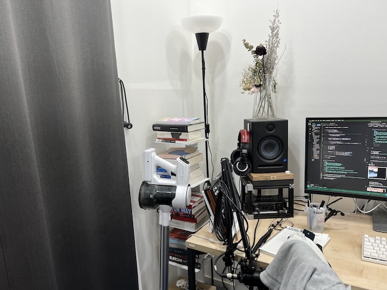
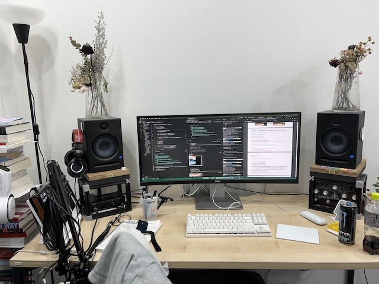
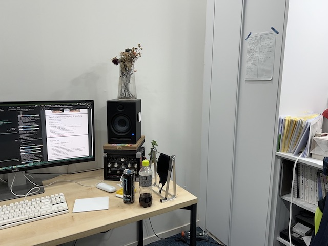

# Panorama Stitching

## Requirements
```zsh
pip install opencv-python
pip install matplotlib
```
## Source Iamges
<div align="center">
  <figure class="thrid"> 
    
    
    
  </figure>
</div>


## Get homography matrix by DLT(Direct Linear Transform)

## Warping

## Stitching

## Result

--- 
## Libraries
- [OpenCV](https://opencv.org/)
- [Numpy](https://numpy.org/)


### Environment
OS: Mac Ventura
Language: Python(3.9.12)
