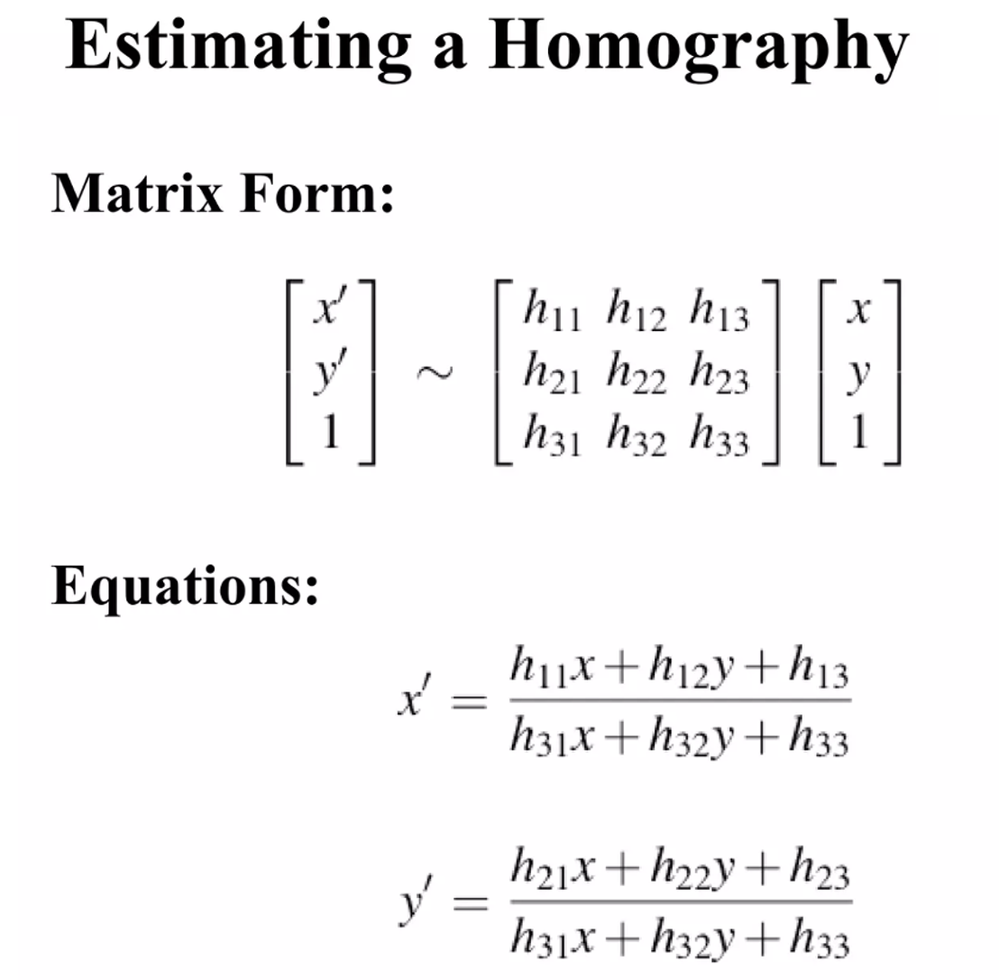

# Panorama Stitching

## Requirements
```zsh
pip install opencv-python
pip install matplotlib
```

## Overview
<div align="center">
  
</div>

- Stitching several images to get panorama image.
- For this, we need to implement **Warping** and **Stitching**.

### Source Iamges
<div align="center">
  <figure class="third"> 
    
    
    
  </figure>
</div>


## Get homography matrix
<!-- <div align="center">
  
</div> -->

<br/>

<div align="center">
  <figure class="third"> 
    
    
    
    </figure>
</div>

## DLT(Direct Linear Transform)
<div align="center">
  <figure class="third"> 
    
    
    
    </figure>
</div>

<br/>

Instead of SVD, I used the LinearAlgebra concept to obtain H.
When using SVD, there are problems such as having to select the smallest value, but when calculating by focusing on the Algebra concept, an h matrix(8x1) can be obtained without selecting a certain value. 

## Warping

## Stitching

## Result


## Libraries
- [OpenCV](https://opencv.org/)
- [Numpy](https://numpy.org/)

## References
Some slides are from [SeonJoo Kim](https://sites.google.com/site/seonjookim/), Yonsei University

[how-to-perform-bilinear-interpolation-in-python](https://stackoverflow.com/questions/8661537/how-to-perform-bilinear-interpolation-in-python)


### Environment
OS: Mac Ventura
Language: Python(3.9.12)
