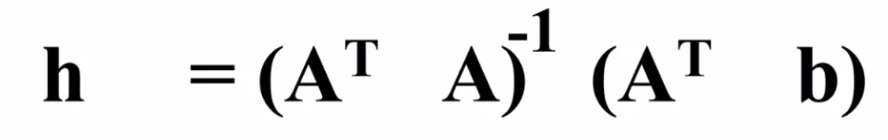
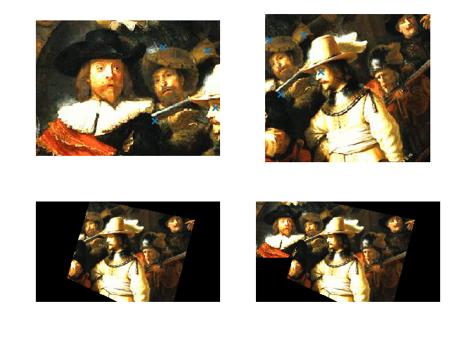

# Panorama Stitching

## Requirements
```zsh
pip install opencv-python
pip install matplotlib
```

## Overview
<div align="center">
  
</div>

- Stitching several images to get panorama image.
- For this, we need to implement **Warping** and **Stitching**.

### Source Iamges
<div align="center">
  <figure class="third"> 
    
    
    
  </figure>
  <div>
    <p>
      <br/>
      <b>Rembrandt, &lt;The Nightwatch&gt;, 1642</b>
    </p>
    
  </div>
</div>


## Get homography matrix
<!-- <div align="center">
  
</div> -->

<br/>

<div align="center">
  <figure class="third"> 
    
    
    
    </figure>
</div>

## DLT(Direct Linear Transform)
<div align="center">
  <figure class="third"> 
    
    
    
    </figure>
</div>

<br/>

Instead of SVD, I used the LinearAlgebra concept to obtain H.
When using SVD, there are problems such as having to select the smallest value, but when calculating by focusing on the Algebra concept, an h matrix(8x1) can be obtained without selecting a certain value. 

### Find h (8x1)
<div align="center">
  
</div>

<br/>

To find h, we should find matrix A and matrix B

### Find A (2Nx8)
Shape of A is (2N,8) and is volatile, so it creates a frame with A = np.empty((0,8)) and adds values corresponding to the matrix whenever a point is added.


**Get matrix A**
```python
N = len(src_points)

xy_1 = src_points
xy_2 = dst_points

# test for n(len) = 8 -> (2n = 16)
len_of_pair = len(xy_1)

# 1. make A
A = np.empty((0, 8))

for idx_a in range(len_of_pair):
    A = np.append(A, np.array([[xy_1[idx_a][0], xy_1[idx_a][1], 1, 0, 0, 0, -
                  xy_1[idx_a][0] * xy_2[idx_a][0], -xy_1[idx_a][1] * xy_2[idx_a][0]]]), axis=0)
    A = np.append(A, np.array([[0, 0, 0, xy_1[idx_a][0], xy_1[idx_a][1], 1, -
                  xy_1[idx_a][0] * xy_2[idx_a][1], -xy_1[idx_a][1] * xy_2[idx_a][1]]]), axis=0)

A = A.astype(int)
```

### Find matrix B (2Nx1)

<div align="center">
  
</div>

<br/>

Get matrix B same as A. Then, H is obtained from A and B by referring to the above equation.
At this time, since H is a 3x3 matrix, 1 is added to h33 by definition.

**Get matrix B and calculate h by A and B**
```python
# 2. make B
B = np.empty((0, 1))

for idx_b in range(len_of_pair):
    B = np.append(B, np.array([[xy_2[idx_b][0]]]), axis=0)
    B = np.append(B, np.array([[xy_2[idx_b][1]]]), axis=0)


# 3. caculate H by A, B
At = np.transpose(A)

part_A = At.dot(A)
part_B = At.dot(B)

H = np.linalg.inv(part_A).dot(part_B)
H = np.transpose(H)[0]
H = np.append(H, 1)
H = np.reshape(H, (3, 3))

return H
```

## Warping
Implement a function that warps according to the target plane using **Bilinar interpolation**. By applying a Homography matrix to the image, src_img is warped to fit the coordinates of the target(dst_img).

<div align="center">
  
</div>

Divide the coordinate scale into trans_x and trans_y and store it as a variable.
Calculate the Villinar interpolation by dividing the water purification part and the decimal part into tx, ty / a, and b. Finally, it is trimmed into int form and returned.


**Bilinear Interpolation**

<div align="center">
  
</div>


```python
warped[y][x] = ((((1.0 - a) * (1.0 - b)) * src_img[ty][tx])
                + ((a * (1.0 - b)) * src_img[ty][tx + 1])
                + ((a * b) * src_img[ty + 1][tx + 1])
                + (((1.0 - a) * b) * src_img[ty + 1][tx]))
```


## Stitching
Stitch only needs to add warped images and dst_img to the process of calculating get_coord, get_homography, and warp in order.

The task of attaching the image was carried out simply by allocating dst_img value after the right-hand coordinate of warped(result)


```python
src_points, dst_points = get_coord(src_img, dst_img)

H = get_homography(src_points, dst_points)

Hi = np.linalg.inv(H)
target_h = int((src_img.shape[0] + dst_img.shape[0]) * 1)
target_w = int((src_img.shape[1] + dst_img.shape[1]) * 1)

warped = warp(src_img, Hi, target_h, target_w)

result_h, result_w = dst_img.shape[:2]
result = np.copy(warped)
result[0:result_h, 0:result_w, :] = dst_img
```

* Hi(H_inverse) should be applied to calculate (because it is the principle that A is warp by calculating Hi on B)

## Result

<div align="center">
  
</div>


## Libraries
- [OpenCV](https://opencv.org/)
- [Numpy](https://numpy.org/)

## References
Some slides are from [SeonJoo Kim](https://sites.google.com/site/seonjookim/), Yonsei University

[how-to-perform-bilinear-interpolation-in-python](https://stackoverflow.com/questions/8661537/how-to-perform-bilinear-interpolation-in-python)


### Environment
OS: Mac Ventura  
Language: Python(3.9.12)
